# High-Level Architecture

This app is a translator plus reliability layer for market data.

Different sources send market data in different formats. The normalizer converts them into one internal Level 2 order book schema, checks whether messages are missing, repairs gaps when possible, and publishes a clean stream to downstream consumers.

```mermaid
flowchart LR
    subgraph Sources["External and captured market data"]
        ITCH["Nasdaq ITCH binary file or capture"]
        FIX["FIX tag-value market data capture"]
        WS["Live or captured WebSocket JSON"]
    end

    subgraph Adapters["Feed adapters"]
        ItchAdapter["ITCH adapter\nreads binary exchange messages"]
        FixAdapter["FIX adapter\nreads tag=value messages"]
        JsonAdapter["JSON adapter\nreads WebSocket market data"]
    end

    subgraph Core["Normalizer core"]
        ParserContracts["Parser contracts\nshared Java interfaces"]
        Normalizer["Normalizer\nmaps source events to one L2 shape"]
        SeqTracker["Sequence tracker\nchecks expected message order"]
        GapDetector["Gap detector\nfinds missing sequence ranges"]
        ReplayBuffer["Ring replay buffer\nkeeps recent normalized messages"]
    end

    subgraph Transport["Internal transport"]
        Proto["Protobuf schema\nsingle internal message contract"]
        ZmqPub["ZeroMQ publisher\nsends normalized updates"]
        ZmqSub["ZeroMQ subscriber\nreceives normalized updates"]
    end

    subgraph Consumers["Downstream consumers"]
        BookBuilder["Book verifier\nrebuilds L2 order books"]
        Metrics["Metrics and reports\nthroughput, gaps, desyncs"]
        ReplayRequester["Replay requester\nasks for missing ranges"]
    end

    subgraph Native["Native acceleration where justified"]
        CppItch["C++ ITCH parser\nlow-latency binary parsing"]
        CppReplay["C++ replay buffer\noptional hot-path storage"]
    end

    ITCH --> ItchAdapter
    FIX --> FixAdapter
    WS --> JsonAdapter

    ItchAdapter --> ParserContracts
    FixAdapter --> ParserContracts
    JsonAdapter --> ParserContracts

    ParserContracts --> Normalizer
    Normalizer --> SeqTracker
    SeqTracker --> GapDetector
    GapDetector --> ReplayBuffer
    ReplayBuffer --> Proto
    Normalizer --> Proto

    Proto --> ZmqPub
    ZmqPub --> ZmqSub
    ZmqSub --> BookBuilder
    BookBuilder --> Metrics
    BookBuilder --> ReplayRequester
    ReplayRequester --> ReplayBuffer

    ItchAdapter -. "only if Java parser is a bottleneck" .-> CppItch
    ReplayBuffer -. "only if Java replay is a bottleneck" .-> CppReplay
```

## Component Purposes

`feed-sources` brings market data into the system. It supports live Coinbase WebSocket capture, captured/file-based processing, official Gemini FIX examples, a provisioned Gemini FIX session, and official Nasdaq ITCH sample windows.

`feed adapters` understand source-specific formats. Each adapter converts raw source messages into the same internal event model.

`protobuf` is the shared message contract. It keeps the normalized stream compact, strict, and usable from both Java and C++.

`ZeroMQ` is the internal delivery pipe. The publisher/subscriber boundary is implemented, while wiring the current capture commands to publish every normalized event is a later transport step.

`sequence-gap detection` watches message numbers. If the stream jumps from sequence `1002` to `1005`, the app knows `1003` and `1004` are missing.

`ring-buffer replay` keeps recent messages in fixed-size memory. When a gap appears, the app can replay the missing range before the book stays wrong.

`book-verifier` proves correctness. It rebuilds order books from normalized messages and counts unresolved desynchronization events.

`benchmark` proves performance. It measures combined ingestion throughput and the effect of replay under controlled packet loss.
