# High-Level Architecture

The app reads market data from three source formats and converts it to one Level 2 protobuf schema.

The shared core tracks source sequences, detects gaps, stores recent events, and can replay events that are still in memory. ZeroMQ and book verification are separate downstream components.

```mermaid
flowchart LR
    subgraph Sources["External and captured market data"]
        ITCH["Nasdaq ITCH binary file or capture"]
        FIX["FIX tag-value market data capture"]
        WS["Live or captured WebSocket JSON"]
    end

    subgraph Adapters["Feed adapters"]
        ItchAdapter["ITCH adapter\nreads binary exchange messages"]
        FixAdapter["FIX adapter\nreads tag=value messages"]
        JsonAdapter["JSON adapter\nreads WebSocket market data"]
    end

    subgraph Core["Normalizer core"]
        ParserContracts["Parser contracts\nshared Java interfaces"]
        Normalizer["Normalizer\nmaps source events to one L2 shape"]
        SeqTracker["Sequence tracker\nchecks expected message order"]
        GapDetector["Gap detector\nfinds missing sequence ranges"]
        ReplayBuffer["Ring replay buffer\nkeeps recent normalized messages"]
    end

    subgraph Transport["Internal transport"]
        Proto["Protobuf schema\nsingle internal message contract"]
        ZmqPub["ZeroMQ publisher\nsends normalized updates"]
        ZmqSub["ZeroMQ subscriber\nreceives normalized updates"]
    end

    subgraph Consumers["Downstream consumers"]
        BookBuilder["Book verifier\nrebuilds L2 order books"]
        Metrics["Metrics and reports\nthroughput, gaps, desyncs"]
        ReplayRequester["Replay requester\nasks for missing ranges"]
    end

    subgraph Native["Native acceleration where justified"]
        CppItch["C++ ITCH parser\nlow-latency binary parsing"]
        CppReplay["C++ replay buffer\noptional hot-path storage"]
    end

    ITCH --> ItchAdapter
    FIX --> FixAdapter
    WS --> JsonAdapter

    ItchAdapter --> ParserContracts
    FixAdapter --> ParserContracts
    JsonAdapter --> ParserContracts

    ParserContracts --> Normalizer
    Normalizer --> SeqTracker
    SeqTracker --> GapDetector
    GapDetector --> ReplayBuffer
    ReplayBuffer --> Proto
    Normalizer --> Proto

    Proto --> ZmqPub
    ZmqPub --> ZmqSub
    ZmqSub --> BookBuilder
    BookBuilder --> Metrics
    BookBuilder --> ReplayRequester
    ReplayRequester --> ReplayBuffer

    ItchAdapter -. "only if Java parser is a bottleneck" .-> CppItch
    ReplayBuffer -. "only if Java replay is a bottleneck" .-> CppReplay
```

## Component Purposes

`feed-sources` reads Coinbase WebSocket data, Gemini FIX data, and Nasdaq ITCH data.

`feed adapters` parse source-specific formats and create the shared event model.

`protobuf` defines the shared normalized message format for Java and C++.

`ZeroMQ` is the internal delivery pipe. The publisher and subscriber classes exist, but the capture commands are not wired to publish events yet.

`sequence-gap detection` watches message numbers and reports missing ranges.

`ring-buffer replay` stores recent events in fixed-size memory and returns available ranges.

`book-verifier` rebuilds order books and reports invalid updates.

`benchmark` measures parser and pipeline throughput.
